<link herf="style.css" rel = "stylesheet"></link>


# Evolution
## 1. AlexNet
### 2015: [Image super-resolution using deep convolutional networks](https://arxiv.org/pdf/1501.00092v3.pdf) (SRCNN)

<p align="center">
  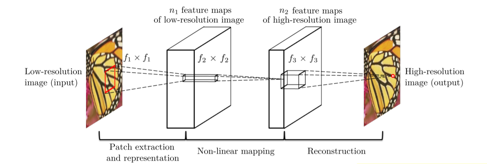<br>
</p>

&&& 算不算decode?
&&& 缩小是不是 incode

- End-to-end mapping between the low/high-resolution images
- Jointly optimizes all layers
- Bicubic interpolation before input?

<div class="center">

|Implementation|Framework|Understandable|
|:---:|:---:|:---:|
|[SRCNN-pytorch](https://github.com/yjn870/SRCNN-pytorch/blob/master/models.py)|Pytorch|&#x2705;|

</div>

## 2. VGGNet
> *Very Deep Convolutional Networks for Large-Scale Image Recognition.*  

<p align="center">
  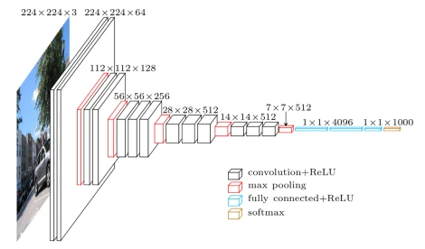<br>
  Architecture of VGG Net
</p>

VGGNet uses smaller kernel and deeper layers.

### 2016: [Accelerating the super-resolution convolutional neural network](https://arxiv.org/pdf/1608.00367v1.pdf) (FSRCNN)

<p align="center">
  <br>
  Conv(<i>f</i>, <i>n</i>, <i>c</i>): conv size, conv number, conv channel
</p>

- **Better performance but lower computational cost than SRCNN**
- Original image as input
- Non-linear mapping is replaced by shrinking, mapping and expending
- Smaller fillter size and deeper network structure

<div class="center">

|Implementation|Framework|Understandable|
|:---:|:---:|:---:|
|[FSRCNN-pytorch](https://github.com/yjn870/FSRCNN-pytorch/blob/master/models.py)|Pytorch|&#x2705;|

</div>

## 3. ResNet
[Paper](https://arxiv.org/pdf/1512.03385)
[Zhihu & Implementation](https://zhuanlan.zhihu.com/p/463935188)

> *A Residual Neural Network (a.k.a. Residual Network, ResNet) is a deep learning model in which the weight layers learn residual functions with reference to the layer inputs. A Residual Network is a network with skip connections that perform identity mappings, merged with the layer outputs by addition.*

<p align="center">
  <br>
  Residual Block
</p>

### 2016 [Accurate Image Super-Resolution Using Very Deep Convolutional Networks](https://arxiv.org/pdf/1511.04587v2.pdf) (VDSR)

- Accurate, single-image SR
- Increasing network depth imporves accuray
- Simpe, effective traning procedure

<p align="center">
  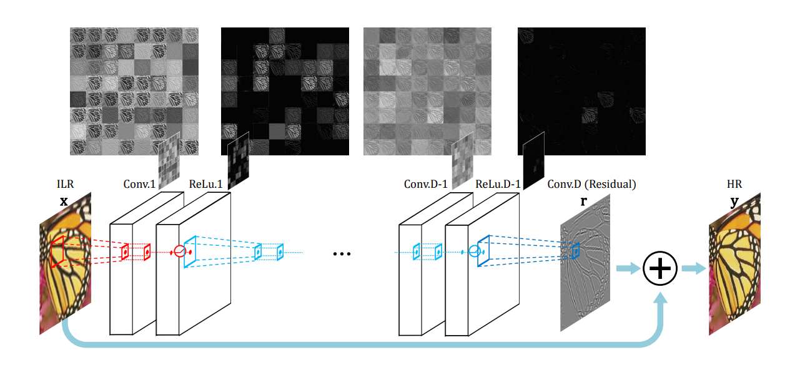<br>
  Cascade a pair of layers (convolutional and nonlinear) repeatedly. 
</p>

### 2017: [Photo-Realistic Single Image Super-Resolution Using a Generative Adversarial Network](https://arxiv.org/pdf/1609.04802v5.pdf) (SRResNet)

<p align="center">
  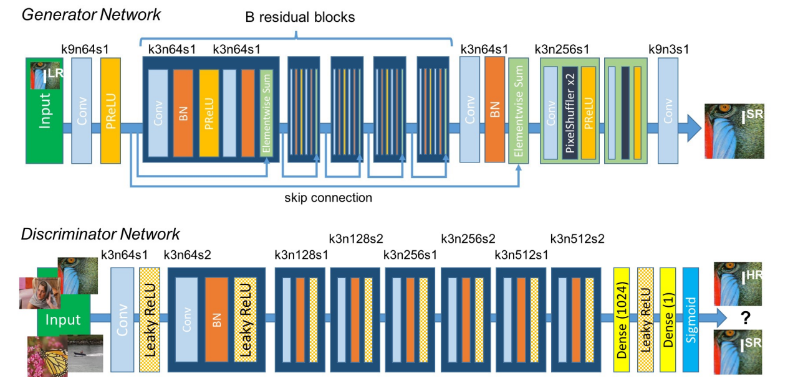<br>
  Architecture of Generator and Discriminator Network with corresponding kernel size (k), number of feature maps (n) and stride (s) indicated for each convolutional layer.
</p>


<div class="center">

|Implementation|Framework|Understandable|
|:---:|:---:|:---:|
|[pytorch-SRResNet](https://github.com/twtygqyy/pytorch-SRResNet/blob/master/srresnet.py)|Pytorch|&#x2705;|
|[ESRGAN](https://github.com/eriklindernoren/PyTorch-GAN/blob/master/implementations/esrgan/models.py)|Pytorch|&#x2705;| 

</div>


### 2016: [Deeply-Recursive Convolutional Network for Image Super-Resolution](https://openaccess.thecvf.com/content_cvpr_2016/papers/Kim_Deeply-Recursive_Convolutional_Network_CVPR_2016_paper.pdf) (DRCN)

- A very-deep recursive conv network
- Increasing recursion depth can improve performance without introducing new params

<p align="center">
  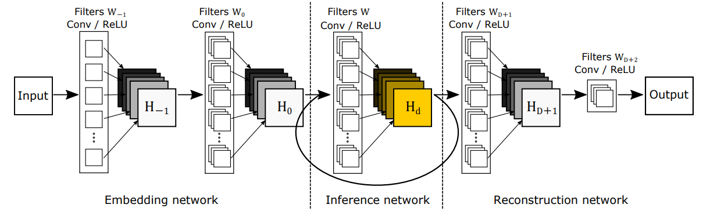<br>
  Three parts: embedding network, inference network and reconstruction network.<br>
  <br>
  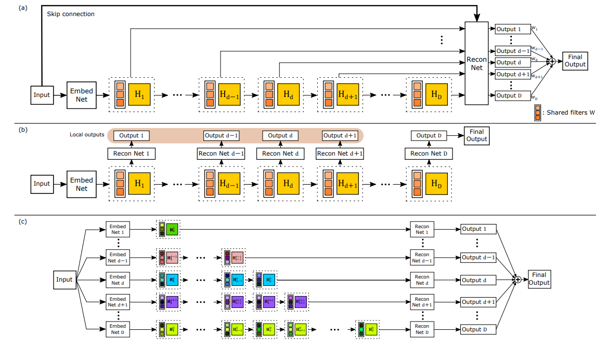<br>
</p>

(a): Final (advanced) model with recursive-supervision and skip-connection. The reconstruction network is shared for recursive predictions. <b>All predictions are used from the intermediate recursion to obtain the final output.</b> 
<span style="text-decoration: line-through">(b): Applying deep-supervision to basic model. Unlike in (a), the model in (b) uses different reconstruction networks for recursions and more parameters are used. (c): An example of expanded structure of (a) without parameter sharing (no recursion). The number of weight parameters is proportional to the depth squared.</span>

<div class="center">

|Implementation|Framework|Understandable|
|:---:|:---:|:---:|
|[super_resolutiondeeply-recursive-cnn-tf](https://github.com/jiny2001/deeply-recursive-cnn-tf/blob/master/super_resolution.py)|TensorFlow|&#x274E;|

</div>

### Image Super-Resolution via Deep Recursive Residual Network (DRRN)

## 4. DenseNet

What is DensNet?

### Image Super-Resolution Using Dense Skip Connections (SRDenseNet)


### Residual Dense Network for Image Super-Resolution (RDN)

## 5. SENet (Channel Attention), Non-Local Attention

### [Squeeze-and-Excitation Network](https://arxiv.org/pdf/1709.01507.pdf) (Channel Attention)

> *In this work, we focus instead on the <b>channel relationship</b> and propose a novel architectural unit, which we term the “Squeeze-and-Excitation” (SE) block, that adaptively recalibrates channel-wise feature responses by explicitly modelling interdependencies between channels.*

<p align="center">
  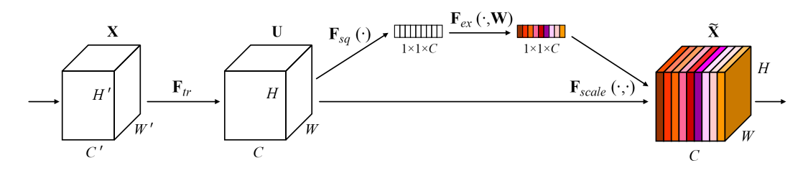<br>
  Squeeze-and-Excitation block.
</p>

Input: $X \in \R^{(C' \times W'\times H')}$ .

**Step 1: Transformation**  
$F_{tr}(X)$ is a conv operator maps $X$ to feature map $U \in \R^{(C \times W \times R)}$ .  
> *Each of the learned filters operates with <b>a local receptive field</b> and consequently each unit of the transformation output <b>$U$ is unable to exploit contextual information outside of this region</b>.*  

**Step 2: Squeeze**  
*To mitigate this problem, <b>squeeze global spatial information into a channel descriptor</b>. This is
achieved by <b>using global average pooling to generate
channel-wise statistics</b>.*  
A.k.a, one channel, one statistic.

$$
z_c = F_{sq}(u_c) = \frac{1}{H \times W}\sum^{H}_{i=1}\sum^{W}_{j=1}{u_c^{(i,j)}}
$$

**Step 3: Excitation**  
$F_{ex}(\cdot,W)$ is a FC layer, map $z^{(1 \times 1 \times C)}$ to $u^{(1 \times 1 \times C)}$.  
And finally: 
$$
F_{sc}(u_c, s_c)=s_cu_c
$$

### (2018) [Image Super-Resolution Using Very Deep Residual Channel Attention Networks](https://openaccess.thecvf.com/content_ECCV_2018/papers/Yulun_Zhang_Image_Super-Resolution_Using_ECCV_2018_paper.pdf) (RCAN)

- A residual in residual (RIR) structure to form very deep network
- Abundant low-frequency information to be bypassed through multiple skip connections
- A channel attention mechanism to adaptively rescale channel-wise features

<p align="center">
  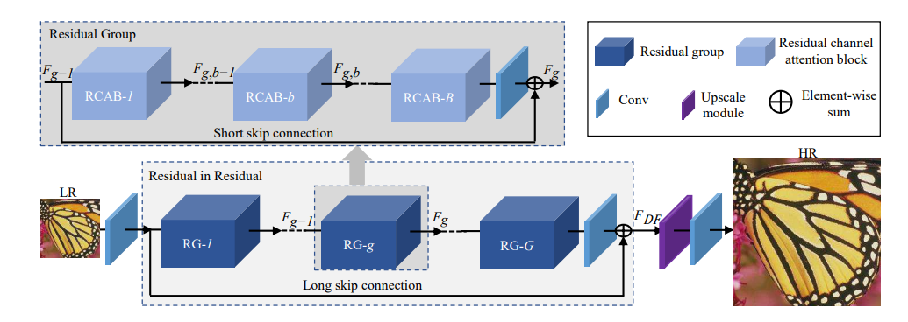<br>
  Archetecture of RCAN
</p>
<p align="center">
  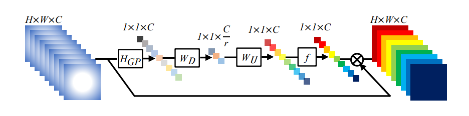<br>
  Channel attention (CA)
</p>
<p align="center">
  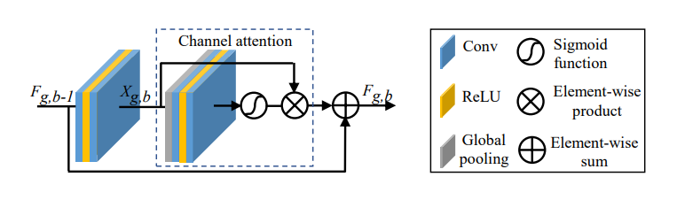<br>
  Residual channel attention block (RCAB)
</p>


<div class="center">

|Implementation|Framework|Understandable|
|:---:|:---:|:---:|
|[RCAN](https://github.com/yulunzhang/RCAN/blob/master/RCAN_TrainCode/code/model/rcan.py)|Pytorch|&#x2705;|

</div>

> *Not dramatically improved compared to RDN.*

---

### [NL](https://zhuanlan.zhihu.com/p/33345791) (Non-Local Attention)

$$
\mathrm{y}_i=\frac{1}{\mathcal{C}(\mathrm{x})}\sum_{\forall j}f(\mathrm{x}_i,\mathrm{x}_j)g(\mathrm{x}_j)
$$

<p align="center">
  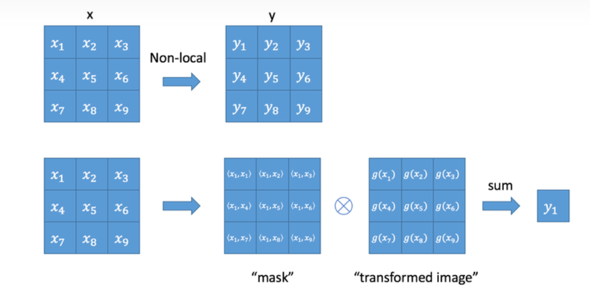<br>
  Size of input is the same as output.
</p>

- $g$ is a $1 \times 1$ conv kernel
- **Gaussian**: $f(\mathrm{x}_i,\mathrm{x}_j)=e^{\mathrm{x}_i^T\cdot\mathrm{x}_j},\mathcal{C}(x)=\sum_{\forall j}f(\mathrm{x}_i,\mathrm{x}_j)$
- **Embedded Gaussian**: $f(\mathrm{x}_i,\mathrm{x}_j)=e^{\theta(\mathrm{x}_i)^T\cdot\phi(\mathrm{x}_j)},\mathcal{C}(x)=\sum_{\forall j}f(\mathrm{x}_i,\mathrm{x}_j)$
- **Dot Product**: $f(\mathbf{x}_{i},\mathbf{x}_{j})=\theta(\mathbf{x}_{i})^{T}\cdot\phi(\mathbf{x}_{j}),\mathcal{C}(x)=|\{i|i\text{ is a valid index of x}\}|$
- **Concatenation**: $f(\mathrm{x}_i,\mathrm{x}_j)=\mathrm{ReLU}(\mathrm{w}_f^T\cdot[\theta(\mathrm{x}_i),\phi(\mathrm{x}_j)]),\mathcal{C}(x)=|\{i|i\text{ is a valid index of x}\}|$

In order to embed non-local to a network, non-local should be designed as a residual block:

$$
\mathrm{z}_i=W_z\cdot\mathrm{y}_i+\mathrm{x}_i
$$

<p align="center">
  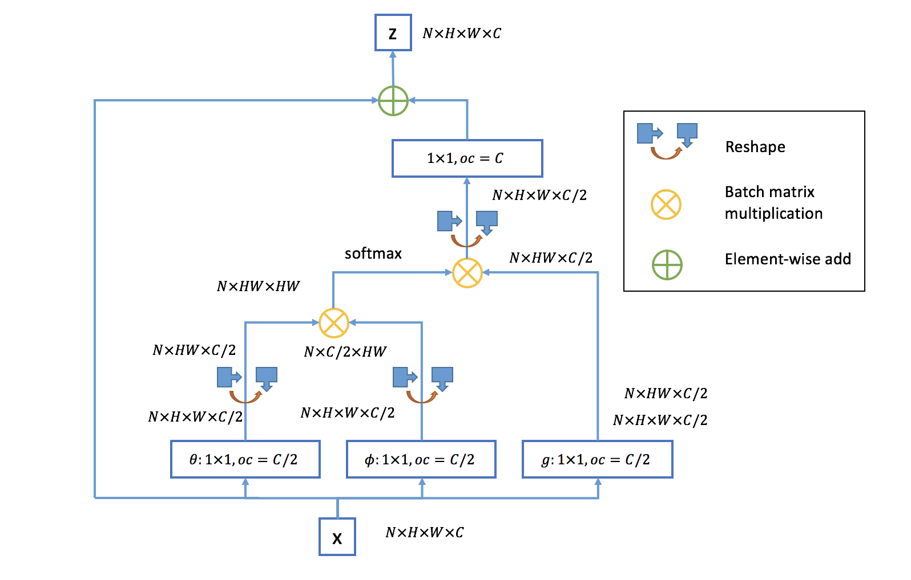<br>
  Optimization, <i>oc</i> is output channels.
</p>

[Self-attention](https://arxiv.org/pdf/1706.03762.pdf) is based on NL.


### CVPR 2019: [Second-order Attention Network for Single Image Super-Resolution](https://openaccess.thecvf.com/content_CVPR_2019/papers/Dai_Second-Order_Attention_Network_for_Single_Image_Super-Resolution_CVPR_2019_paper.pdf) (SAN)

- A novel trainable second-order channel attention (SOCA) model rescales the channel-wise features by using second-order feature stastics
- None-locally enhanced residual attention group

<p align="center">
  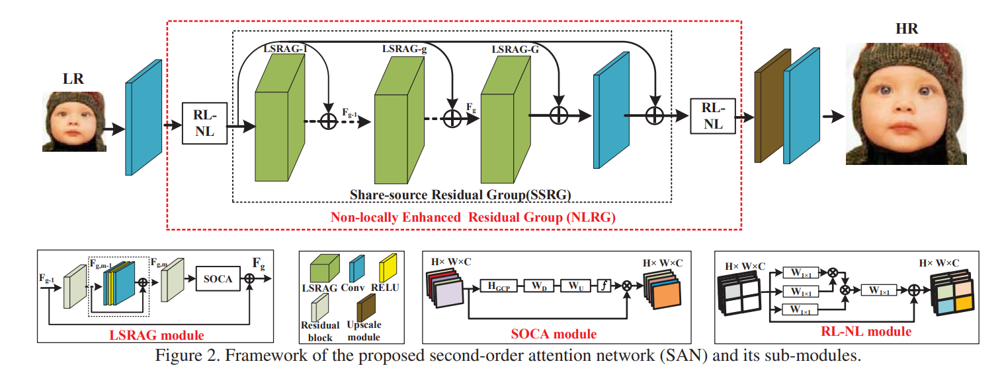<br>
  Framework of the proposed second-order attention network (SAN) and its sub-modules.
</p>

**Non-locally Enhanced Residual Group (NLRG)** consists of several **region-levelnon-local (RL-NL)** modules and one **share-source residual group (SSRG)** structure.  

> The RL-NL exploits the abundant structure cues in LR features and the self-similarities in HR nature scenes.  
> The SSRG is composed of G local-source residual attention groups (LSRAG) with share-source skip connections (SSC).  
> Each LSRAG further contains M simplified residual blocks with local-source skip connection, followed by a second-order channel attention (SOCA) module to exploit feature interdependencie  

**a. Region-level non-local module (RL-NL)**  

> Traditional global level non-local operations may be limited for some reasons:
>
> 1. Global-level non-local operations require unacceptable computational burden, especially when the size of feature is large
> 2. It is empirically shown that non-local operations
at a proper neighborhood size are preferable for low-level
tasks (e.g., image super-resolution)  
>
> **Thus for feature with higher spatial resolution or degradation, it is natural to perform region-level non-local operations.**

**b. Local-source residual attention group (LSRAG)**  
> Due to our share-source skip connections, the abundant low frequency information can be bypassed. To go a further step to residual learning, **we stack M simplified residual blocks to form a basic LSRAG**.

**c. Second-order Channel Attention (SOCA)**  
> SENet only exploits first-order statistics of features by global average pooling, while ignoring statistics higher than first-order, thus hindering the discriminative ability of the network.  
> Propose a second-order channel attention (SOCA) module to learn **feature interdependencies** by considiering second-order statistics of features.
- Covariance Normalization
- Channel Attention
- Acceleration

<div class="center">

|Implementation|Framework|Understandable|
|:---:|:---:|:---:|
|[SAN](https://github.com/daitao/SAN/blob/master/TrainCode/model/san.py#L347)|Pytorch|&#x274E;|

</div>

### 2020: Single Image Super-Resolution via a Holistic Attention Network (HAN)

[Paper Download](https://arxiv.org/pdf/2008.08767.pdf)

Importance:
- Channel attention treats each convolution layer as a separate process that misses the correlation among different layers
- Layer attention module (LAM) and a channel-spatial attention module (CSAM), to model the **holistic interdependencies** among layers, channels, and positions

<p align="center">
  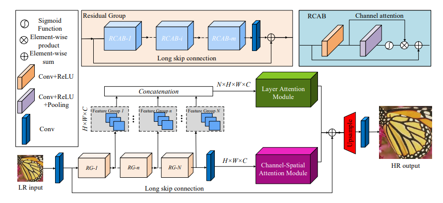<br>
  Architecture of HAN.
</p>

1. The first convolutional layer extracts a set of shallow feature maps. <br>
2. Then a series of residual groups further extract features.<br>
3. LAM learns <b>the correlations of each output from RGs</b>.<br> 
4. CSAM learns <b>the interdependencies between channels and pixels</b>.

<p align="center">
  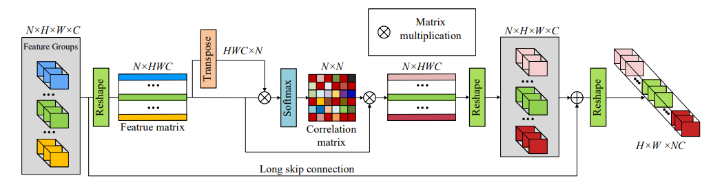<br>
  Architecture of the proposed LAM.
</p>

<p align="center">
  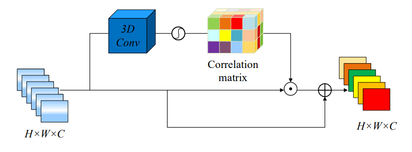<br>
  Architecture of the proposed CSAM.
</p>

<p align="center">
  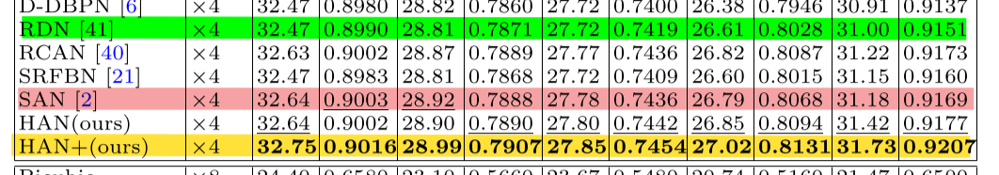<br>
  Quantitative results with BI degradation model.
</p>

### Image Super-Resolution with Cross-Scale Non-Local Attention and Exhaustive Self-Exemplars Mining (CSNLN)  


### Context Reasoning Attention Network for Image Super-Resolution (CRAN)

## 6. ViT (Transformer)

### Self-Attention + Transformer

- [Attention is all you need, 2017](https://arxiv.org/pdf/1706.03762)
- [Slef-Attention Review, cn](https://zhuanlan.zhihu.com/p/410776234)
- [Transformer Review, cn](https://zhuanlan.zhihu.com/p/311156298)

> *The dominant sequence transduction models are based on complex recurrent or convolutional neural networks that include an encoder and a decoder.*
>
> *We propose a new simple network architecture, the Transformer, **based solely on attention mechanisms, dispensing with recurrence and convolutions entirely**.*

Slef-Attention allows the model to **weigh the importance of different elements** in an input sequence and **dynamically adjust their influence** on the output.

E.g.
> The animal didn’t cross the street because it was too tired
> The animal didn’t cross the street because it was too wide

Seq2Seq models are hard to predict the content after *'it'* because the content before 'it' is the same.  
However, self-attention calculates the importance of each word, and the importance of 'it' is different in the two sentences.

<p align="center">
  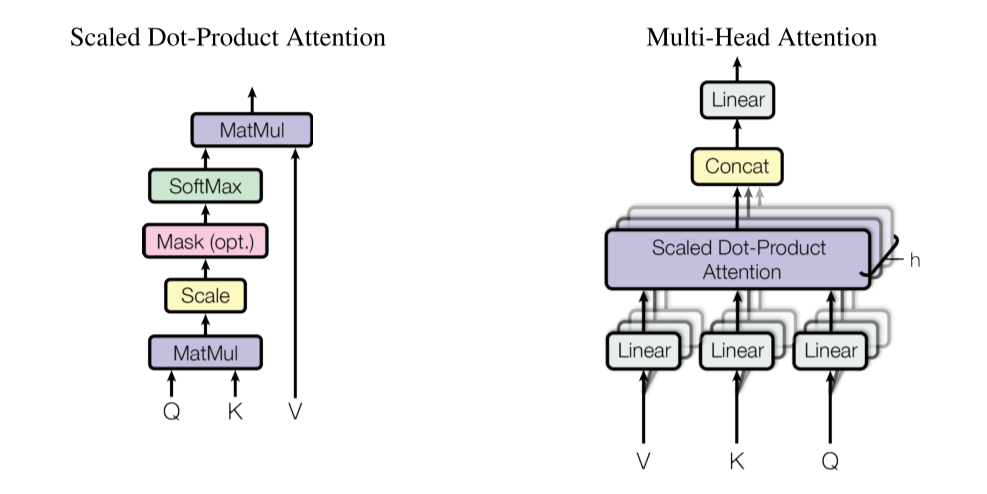<br>
  Saled Dot-Product Attention vs. Multi-Head Attention
</p>

> *Instead of performing a single attention function with dmodel-dimensional keys, values and queries, we found it beneficial to linearly project the queries, keys and values h times with **different, learned linear projections** to dk, dk and dv dimensions, respectively.*

```python
# input : batch_size * seq_len * input_dim
Q = self.q(x).reshape(-1,x.shape[0],x.shape[1],self.dim_k // self.nums_head) 
K = self.k(x).reshape(-1,x.shape[0],x.shape[1],self.dim_k // self.nums_head) 
V = self.v(x).reshape(-1,x.shape[0],x.shape[1],self.dim_v // self.nums_head)
```


### CVPR 2021: Pre-Trained Image Processing Transformer (IPT)

IPT采用了原版的Transformer, 模型的参数量很大 (116M), 因此模型训练的难度会比较大, 作者利用ImageNet作为基线数据集来预训练模型. 

这篇论文第一个提出将Transformer应用于底层视觉任务, 且不止做图像超分辨率一个任务, 而是同时做去噪, 去雨, 超分三个任务. 通过构建一个基于Transformer的预训练模型, 利用上它强大的表征能力, 以Transformer为核心, 配上不同的Head和Tails, 以完成相对应的底层视觉任务. 在超分任务中, IPT的效果比起各种注意力机制也要明显一些. 

## 7. Transformer 魔改
在这一阶段, 分类模型的优化基本演变为了Transformer的魔改, 主要改进方向有两个： (1)对Transformer本身的优化, 包括模型结构优化, 轻量化等;  (2)CNN和Transformer的结合, 以Swin Transformer为典型代表. 这些Transformer的魔改同样被搬到了底层视觉任务. 

1. SwinIR: Image Restoration Using Swin Transformer (SwinIR, ICCV 202)1
2. Image super-resolution with non-local sparse attention (NLSA, CVPR 202)1
3. Efficient Non-Local Contrastive Attention for Image Super-Resolution (ENLCA, AAAI 202)2
4. Rich CNN-Transformer Feature Aggregation Networks for Super-Resolution (AC)T

这些模型的创新不是很足, 有些甚至可以说是Transformer变体在底层视觉任务中的应用, 如SwinIR套用了Swin Transformer, NLSA套用了ReFormer. 但像SwinIR等基本都会做多个底层视觉任务, 工作量都很大. 

在这一阶段的魔改中, Swin Transformer算是一个非常成功的改进, 创造性的提出了局部注意力计算模块LSA, 即仅仅在窗口内计算自注意力, 相比ViT性能也有极大的提升, 将Transformer 实用性提升了一大步. 而更多的论文则是对Transformer引入CNN的局部信息来提升性能和收敛速度, 虽然多少有些效果, 但这种混合CNN和Transformer的做法我觉得违背了设计初衷. 但是从目前来看, CNN和Transformer本身就没啥好特意区分的, 两者在某个角度上甚至是等价的. 

## 8. Pre-training + Transformer
1. On Efficient Transformer-Based Image Pre-training for Low-Level Vision (ED)T
2. Activating More Pixels in Image Super-Resolution Transformer (HA)T

EDT论文中指出：预训练在不同low-level任务中起不同的作用. 比如, 在超分任务中, 预训练可以为更高层引入更多局部信息, 进而产生显著性能提升; 与此同时, 预训练几乎不会影响降噪网络的内部特征表达, 故而产生了轻微的性能提升. 更进一步, 通过探索了不同的预训练方法并证实：多任务预训练更有效且数据高效. 

## 9. MLP
1. MAXIM: Multi-Axis MLP for Image Processing (MAXIM, CVPR 2022)

MAXIM这篇论文实际上没有做图像超分辨率, 而是做了去噪, 去模糊, 去雨, 去雾, 增强五个任务. 超分任务一般用单尺度的架构, 而这篇文章采用了UNet作为基础算法, 具有多尺度结构, 所以没有做超分 (一样的情况还有Uformer: A General U-Shaped Transformer for Image Restoration, 也是采用了UNet结构, 做了其他底层视觉任务但没有做超分). 但实际上, 把MAXIM或者其他MLP变体的主要block搬到单尺度的超分拓扑中, 应该也是完全行得通的. 

在2019年的综述Deep Learning for Image Super-resolution: A Survey中, 将图像超分辨率的结构分为以下四种：(a)前端上采样Pre-upsampling SR; (b)后端上采样Post-upsampling SR; (c)渐进式上采样Progressive upsampling SR; (d)升降采样迭代Iterative up-and-down Sampling SR. 


在发展过程中, 后端上采样的结构具有引入噪声少, 速度快的优点, 逐渐成为主流. 目前, 图像超分辨率这一领域已趋于成熟, 不再区分上述四种形式, 基本已经统一为先修复, 再放大的结构, 即后端上采样. 模型基本都遵循相同的定式：浅层特征提取 (head)+深层特征提取 (body)+重建模块 (tail). 随着分类模型的推进, 图像超分辨率的改进目前大多都是在以上定式之下, 改进网络的body (CNN/Transformer/MLP). 

[zh](https://zhuanlan.zhihu.com/p/558561628)

