# SR 发展史 Review 汇报

## 1. 基于 AlexNet 的 SR 模型
### 1.1. Image super-resolution using deep convolutional networks (SRCNN, 2015)

   

- 利用卷积实现 SR

|Implementation|Framework|Understandable|
|:---:|:---:|:---:|
|[SRCNN-pytorch](https://github.com/yjn870/SRCNN-pytorch/blob/master/models.py)|Pytorch|&#x2705;|

## 2. 基于 VGG 的 SR 模型
### 2.1. VGG 简介

  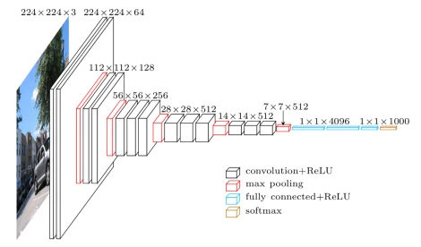 

- 更小的卷积核和更深的网络

### 2.2. Accelerating the super-resolution convolutional neural network (FSRCNN, 2016)

  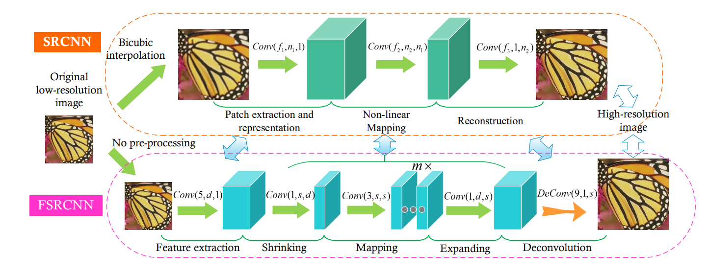 
  Conv(<i>f</i>, <i>n</i>, <i>c</i>): kernel size, kernel number (output channel), kernel channel

- 更小的计算代价和更好的结果
- 替换 SRCNN 中的 Non-Linear Mapping

|Implementation|Framework|Understandable|
|:---:|:---:|:---:|
|[FSRCNN-pytorch](https://github.com/yjn870/FSRCNN-pytorch/blob/master/models.py)|Pytorch|&#x2705;|

## 3. 基于 ResNet 的 SR 模型

### 3.1. RestNet 简介

   

$$
F(x) = H(x) - x
$$

### 3.2. Accurate Image Super-Resolution Using Very Deep Convolutional Networks (VDSR, 2016)

   

- CNN + ResNet

### 3.3. Deeply-Recursive Convolutional Network for Image Super-Resolution (DRCN, 2016)

   
  

- 对比发现模型 (a) 效果最好
- (a) 中每次递归的输出和最初的输入会被一同放入识别网络, 形成 ResNet 结构

|Implementation|Framework|Understandable|
|:---:|:---:|:---:|
|[super_resolutiondeeply-recursive-cnn-tf](https://github.com/jiny2001/deeply-recursive-cnn-tf/blob/master/super_resolution.py)|TensorFlow|&#x274E;|

### 3.4. Photo-Realistic Single Image Super-Resolution Using a Generative Adversarial Network (SRResNet, 2017)

   

- GAN + ResNet

|Implementation|Framework|Understandable|
|:---:|:---:|:---:|
|[pytorch-SRResNet](https://github.com/twtygqyy/pytorch-SRResNet/blob/master/srresnet.py)|Pytorch|&#x2705;|
|[ESRGAN](https://github.com/eriklindernoren/PyTorch-GAN/blob/master/implementations/esrgan/models.py)|Pytorch|&#x2705;| 

## 4. 基于 DenseNet 的 SR 模型

Densnet 的稠密连接方式可以使得每一层都可以利用之前学习到的所有特征.

### 4.1. Residual Dense Network for Image Super-Resolution (RDN, 2018)

   
  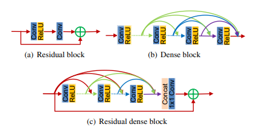

- ResNet 做的是 "add", 而 DenseNet 做的是 "concat"
- 每层输入来自前层的输出?
- 效果相比 ResNet 更好

## 5. 基于 Channel Attention 和 Non-Local Attention 的 SR 模型

### 5.1. 什么是 Channel Attention
源自: Squeeze-and-Excitation Networks (SENet, 2017)

   

- 卷积操作 (卷积核) 本身的感受有限
- 因此希望寻找同一通道的特征

Input: $X \in \R^{(C' \times W'\times H')}$ .

**Step 1: Transformation**  
$F_{tr}(X)$ is a conv operator maps $X$ to feature map $U \in \R^{(C \times W \times R)}$ .  

**Step 2: Squeeze**  

$$
z_c = F_{sq}(u_c) = \frac{1}{H \times W}\sum^{H}_{i=1}\sum^{W}_{j=1}{u_c^{(i,j)}}
$$

**Step 3: Excitation**  
$F_{ex}(\cdot,W)$ is a FC layer, map $z^{(1 \times 1 \times C)}$ to $u^{(1 \times 1 \times C)}$.  
And finally: 
$$
F_{sc}(u_c, s_c)=s_cu_c
$$

### 5.2. Image Super-Resolution Using Very Deep Residual Channel Attention Networks (RCAN, 2018)

  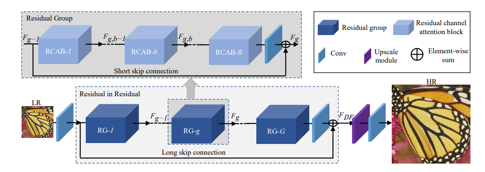 
  Archetecture of RCAN

   
  Channel attention (CA)

   
  Residual channel attention block (RCAB)

- RIR, 残差网络中用残差网络
- 多个 skip connection
- Channel Attention

|Implementation|Framework|Understandable|
|:---:|:---:|:---:|
|[RCAN](https://github.com/yulunzhang/RCAN/blob/master/RCAN_TrainCode/code/model/rcan.py)|Pytorch|&#x2705;|

### 5.3. 什么是 Non-Local Attention

$$
\mathrm{y}_i=\frac{1}{\mathcal{C}(\mathrm{x})}\sum_{\forall j}f(\mathrm{x}_i,\mathrm{x}_j)g(\mathrm{x}_j)
$$

  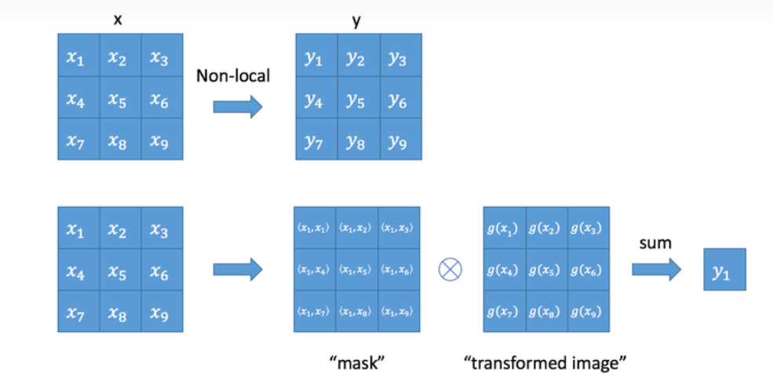 

- 同样为了解决卷积核视野小的问题
- 计算复杂度高

<!-- - $g$ is a $1 \times 1$ conv kernel
- **Gaussian**: $f(\mathrm{x}_i,\mathrm{x}_j)=e^{\mathrm{x}_i^T\cdot\mathrm{x}_j},\mathcal{C}(x)=\sum_{\forall j}f(\mathrm{x}_i,\mathrm{x}_j)$
- **Embedded Gaussian**: $f(\mathrm{x}_i,\mathrm{x}_j)=e^{\theta(\mathrm{x}_i)^T\cdot\phi(\mathrm{x}_j)},\mathcal{C}(x)=\sum_{\forall j}f(\mathrm{x}_i,\mathrm{x}_j)$
- **Dot Product**: $f(\mathbf{x}_{i},\mathbf{x}_{j})=\theta(\mathbf{x}_{i})^{T}\cdot\phi(\mathbf{x}_{j}),\mathcal{C}(x)=|\{i|i\text{ is a valid index of x}\}|$
- **Concatenation**: $f(\mathrm{x}_i,\mathrm{x}_j)=\mathrm{ReLU}(\mathrm{w}_f^T\cdot[\theta(\mathrm{x}_i),\phi(\mathrm{x}_j)]),\mathcal{C}(x)=|\{i|i\text{ is a valid index of x}\}|$ -->

将 Non-Local 定义为 Residual Block 可以直接插入模型中;  
还提出了矩阵运算的加速方法:

$$
\mathrm{z}_i=W_z\cdot\mathrm{y}_i+\mathrm{x}_i
$$

  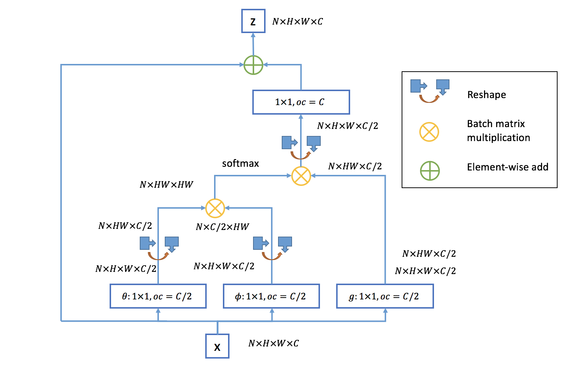 
  Optimization, <i>oc</i> is output channels.

<!-- [Self-attention](https://arxiv.org/pdf/1706.03762.pdf) 和 NL 类似. -->

### 5.4. Second-order Attention Network for Single Image Super-Resolution (SAN, 2019)

   

- 用 SOCA 代替 Channel Attention
- 传统 Non-Local 计算量太大, 提出 Region-Level Non-Local

与 CA 求平均数不同, SOCA 计算了协方差矩阵 (与 EigenFace 类似) 去提取特征间的独立性.

<!-- A novel trainable second-order channel attention (SOCA) model rescales the channel-wise features by using second-order feature stastics
- None-locally enhanced residual attention group

   
  Framework of the proposed second-order attention network (SAN) and its sub-modules.

**Non-locally Enhanced Residual Group (NLRG)** consists of several **region-levelnon-local (RL-NL)** modules and one **share-source residual group (SSRG)** structure.  

> The RL-NL exploits the abundant structure cues in LR features and the self-similarities in HR nature scenes.  
> The SSRG is composed of G local-source residual attention groups (LSRAG) with share-source skip connections (SSC).  
> Each LSRAG further contains M simplified residual blocks with local-source skip connection, followed by a second-order channel attention (SOCA) module to exploit feature interdependencie  

**a. Region-level non-local module (RL-NL)**  

> Traditional global level non-local operations may be limited for some reasons:
>
> 1. Global-level non-local operations require unacceptable computational burden, especially when the size of feature is large
> 2. It is empirically shown that non-local operations
at a proper neighborhood size are preferable for low-level
tasks (e.g., image super-resolution)  
>
> **Thus for feature with higher spatial resolution or degradation, it is natural to perform region-level non-local operations.**

**b. Local-source residual attention group (LSRAG)**  
> Due to our share-source skip connections, the abundant low frequency information can be bypassed. To go a further step to residual learning, **we stack M simplified residual blocks to form a basic LSRAG**.

**c. Second-order Channel Attention (SOCA)**  
> SENet only exploits first-order statistics of features by global average pooling, while ignoring statistics higher than first-order, thus hindering the discriminative ability of the network.  
> Propose a second-order channel attention (SOCA) module to learn **feature interdependencies** by considiering second-order statistics of features.
- Covariance Normalization
- Channel Attention
- Acceleration -->

|Implementation|Framework|Understandable|
|:---:|:---:|:---:|
|[SAN](https://github.com/daitao/SAN/blob/master/TrainCode/model/san.py#L347)|Pytorch|&#x274E;|

### 5.5 Single Image Super-Resolution via a Holistic Attention Network (HAN, 2020)

  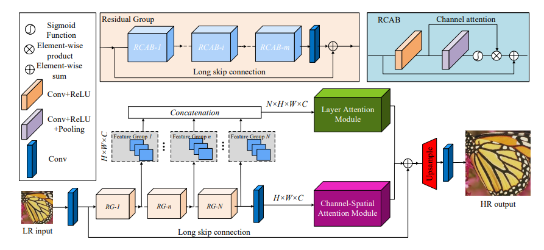 
  HAN
   
  Layer Attention Module
   
  Channel-Spatial Attention Module

- Channel Attention 只提取了同一层的特征, 忽略了不同层之间的特征
- 因此提出 Layer attention module (LAM) 和  channel-spatial attention module (CSAM) 同时提取相同层, 不同通道, 和不同位置的特征

<!-- 1. The first convolutional layer extracts a set of shallow feature maps.  
2. Then a series of residual groups further extract features. 
3. LAM learns <b>the correlations of each output from RGs</b>.  
4. CSAM learns <b>the interdependencies between channels and pixels</b>. -->

### 5.5. Attention vs. Dense

   
  Quantitative results with BI degradation model.

## 6. 基于 Transformer 的 SR 模型
### 6.1. 什么是 Transformer

- 发现当时主流的 NLP 模型都是复杂递归 / 卷积网络 + Attention 机制
- 因此做减法, 只用 Attention 机制

   
   

1. Self-Attention 直接得到输入序列间的 Attention 值, 不需要递归求解
2. Multi-Head Self-Attention 提取多维特征
3. 缺少位置信息, 用 Positional Encoding 处理
4. Mask
    - Padding Mask: 解决输入长度不一致
    - Sequence Mask: 计算 Self-Attetion 时遮挡未来数据, 保留当前时刻 t 之前的数据

|Implementation|Framework|Understandable|
|:---:|:---:|:---:|
|[attention-is-all-you-need-pytorch](https://github.com/jadore801120/attention-is-all-you-need-pytorch/tree/master/transformer)|Pytorch|&#x2705;|

### 6.2. ViT 简介

   

- Transformer 在 NLP 有很好的应用; 在视觉领域, Attenttion 机制多被用于卷积操作的一部分
- 提出使用纯粹的 Transformer 机制进行图像识别, 模型简单效果好, 扩展性强

**CNN 的归纳偏置 (Inductive Bias)**

1. 局部性 (Locality / Two-Dimensional Neighborhood Structure), 即图片上相邻区域有相似特征
2. 平移不变性 (Translation Equivariance),$f(g(x))=g(f(x))$, 其中 $f$ 表示平移操作, $g$ 表示平移操作

由于 CNN 具有以上两种归纳偏置, 训练前就有了很多先验信息, 因此需要较少数据就可以学习到一个比较好的模型.

**因此, 当训练数据集不够大的时候, ViT 的表现通常比同等大小的 ResNets 要差一些.**

作者发现 **不管使用哪种位置编码方式, 模型的精度都很接近**, 甚至不适用位置编码, 模型的性能损失也没有特别大.

<!-- 原因可能是 ViT 计算 Image Patch 上的 Attention, 而不是 Pixel;  
对网络来说这些 Patch 之间的相对位置信息很容易理解, 所以使用什么方式的位置编码影响都不大. -->

|Implementation|Framework|Understandable|
|:---:|:---:|:---:|
|[vit-pytorch](https://github.com/lucidrains/vit-pytorch/blob/main/vit_pytorch/vit_1d.py)|Pytorch|&#x2705;|

### 6.3. Swin Transformer 简介
<!-- [分析的很好的知乎链接](https://zhuanlan.zhihu.com/p/401661320) -->

  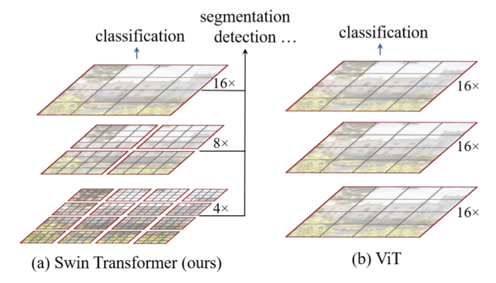 
   
  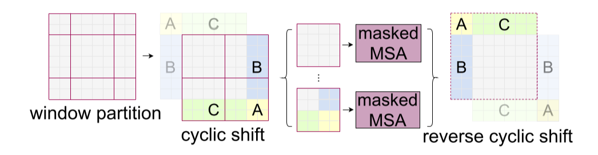

- 问题 1: 图像中的对象 Scale 变化尺度会很大, 相同大小的 Patch 难以准确捕捉信息
- 问题 2: Transformer 计算复杂度太高
- 解决 1: 通过与 CNN 类似的分层结构处理图片, 使模型能灵活处理不同尺度的对象
- 解决 2: 采用 Window Self-Attention, 降低复杂度

1. 相对位置编码
2. Cyclic Shift => 跨窗口特征提取
3. 子窗口编码 + Mask => 计算 Self-Attention

|Implementation|Framework|Understandable|
|:---:|:---:|:---:|
|[Swing-Transformer](https://github.com/microsoft/Swin-Transformer/blob/main/models/swin_transformer.py)|Pytorch|&#x274E;|

### 6.4. Pre-Trained Image Processing Transformer (IPT, 2020)

  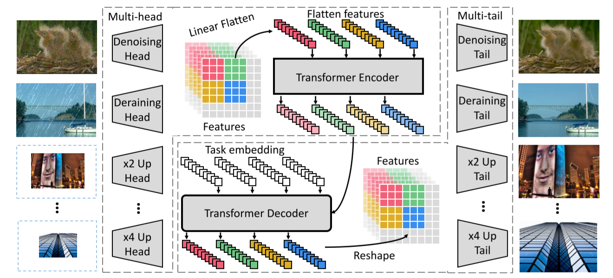 
  

- ViT 
- 看到了 Transformer 在 NLP 的表现力, 应用于 CV 基础问题: 去噪, 超分辨和去雨
- 参数多, 比较难训练

|Implementation|Framework|Understandable|
|:---:|:---:|:---:|
|[Pretrained-IPT](https://github.com/huawei-noah/Pretrained-IPT/blob/main/model/ipt.py)|Pytorch|&#x2705;|

### 6.5. SwinIR: Image Restoration Using Swin Transformer (SwinIR, 2021)

   

- Swin Transformer + ResNet

### 6.6 Image super-resolution with non-local sparse attention (NLSA, 2021)

  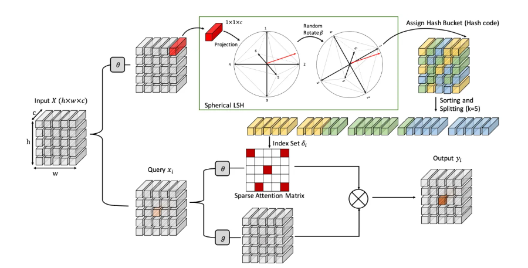 

图像超分是一个被研究多年的任务, 作为一个非适定性 (ill-posed) 问题, 往往需要 **加入许多图像先验作为正则化**, 例如最具有代表性的**稀疏, 非局部先验**

稀疏性约束在单张图超分 SISR (Singel Image Super-Resolution) 上已被很好地探索, 利用 **稀疏编码 (sparse coding)**, 图像 (图块) 可视作预先定义好的过完备字典, 小波 (wavelet), 曲波 (curvelet) 的稀疏线性组合.  
**深度学习方法例如 SRCNN 也首先使用卷积实现了稀疏编码 (50%的特征被 ReLU 置为 0).**

此外, 非局部的图像先验 (Non-Local, NL) 也被很好地探索. NL 通过 **全局搜索相关联的特征进行叠加** 来增强图像表征. 不过应用在SISR上时会出现两个问题：

1. 在网络深层, 特征的感受野很大甚至是全局性的, 会导致 NL 计算的互相关性不准确.  
2. NL 需要计算每个点之间的互相关性, 此计算量与图像大小成平方正相关, 为了解决这个问题, 一般会计算局部的相关性, 但这样做又会失去全局的特征。

对此, 本文为 SISR 任务提出一种稀疏的全局注意力模块, 以此大大降低 NL 的计算量, 并将其嵌入例如 EDSR 这样的网络来形成 Non-Local Sparse Network (NLSN).

- 哈希桶 + 超球, 两个向量的角度小更有可能落入同一个哈希桶中

## 7. 基于 Pre-Trained 和 Transformer 的 SR 模型
### 7.1. On Efficient Transformer-Based Image Pre-training for Low-Level Vision (EDT, 2022)

   

- 预训练在不同 low-level 任务中起不同的作用
- 通过探索了不同的预训练方法并证实: 多任务预训练更有效且数据高效

## 8. 总结
Ref: [桃川京夏](https://zhuanlan.zhihu.com/p/558561628)

在 2019 年的综述 *Deep Learning for Image Super-resolution: A Survey* 中, 将图像超分辨率的结构分为以下四种：

1. 前端上采样 Pre-upsampling SR
2. 后端上采样 Post-upsampling SR
3. 渐进式上采样 Progressive upsampling SR
4. 升降采样迭代 Iterative up-and-down Sampling SR. 

   

在发展过程中, 后端上采样的结构具有引入噪声少, 速度快的优点, 逐渐成为主流.  

目前, 图像超分辨率这一领域已趋于成熟, 不再区分上述四种形式, 基本已经统一为先修复, 再放大的结构, 即后端上采样.  

模型基本都遵循相同的定式：浅层特征提取 (head) + 深层特征提取 (body) + 重建模块 (tail).  

随着分类模型的推进, 图像超分辨率的改进目前大多都是在以上定式之下, 改进网络的body (CNN / Transformer / MLP). 

